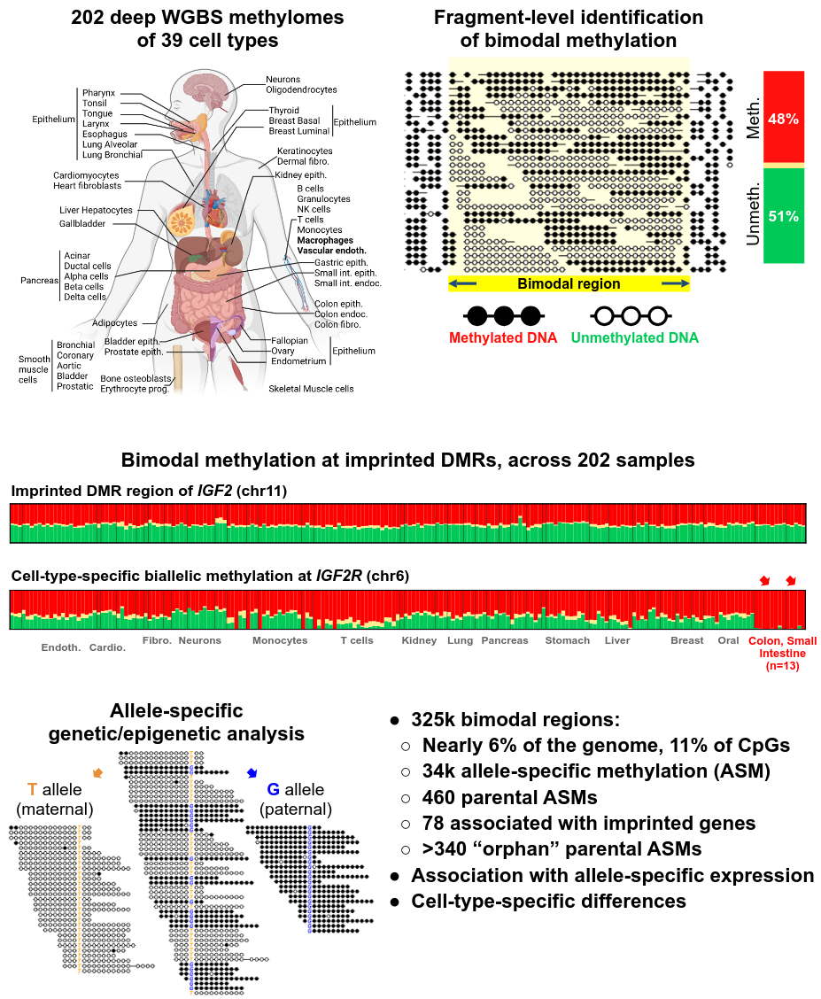

# code for the paper [Atlas of imprinted and allele-specific DNA methylation in the human body](https://www.nature.com/articles/s41467-025-57433-1)

Here we present a the code used to build a comprehensive atlas of allele-specific DNA methylation using deep whole-genome sequencing across 39 normal human cell types. For the dataset, see the previously published paper by our lab [here](https://www.nature.com/articles/s41586-022-05580-6).

  
This project is developed by Jonathan Rosenski in [Prof. Tommy Kaplan's lab](https://www.cs.huji.ac.il/~tommy/) at the Hebrew University, Jerusalem, Israel.

WGBS data was pre-processed with [wgbs_tools](https://github.com/nloyfer/wgbs_tools).

For a UCSC genome browser session of our human imprinting atlas, please see [here](https://genome-euro.ucsc.edu/s/tomkap/hg19_Imp).

## Citation
[Rosenski, Peretz, Magenheim, Loyfer, et al. (2025)](https://www.nature.com/articles/s41467-025-57433-1). Atlas of imprinted and allele-specific DNA methylation in the human body.
